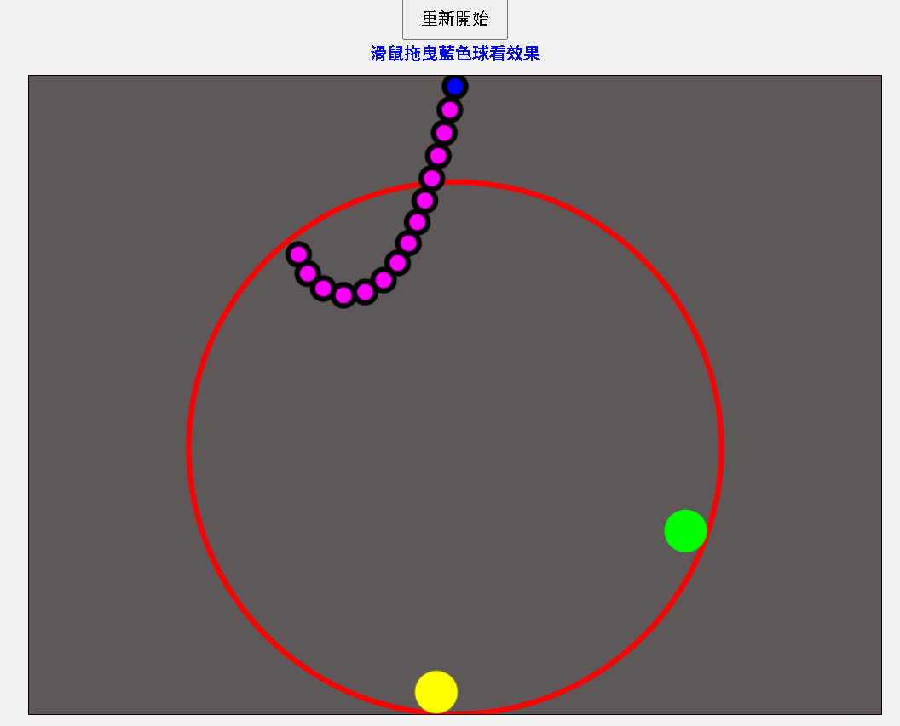

# Chain and Ball Physics Simulator Using Position-Based Dynamics

[▶️ View Live Demo](https://opming7788.github.io/Two-Ball-Collision-Simulation-Using-Position-Based-Dynamics/pos_chain_ball.html)

This project is a web-based (HTML + JavaScript) physics simulator that uses **Position-Based Dynamics (PBD)** to model the motion of a chain and simulate collisions between two balls.  
The system simulates the movement of a chain under the influence of gravity and handles collision responses between two small balls.  
By applying Position-Based Dynamics methods to calculate both chain dynamics and collision reactions, it achieves a more realistic and stable simulation effect.

---

## Technologies Used

- **HTML / CSS / JavaScript**
- **Canvas API**
  - Real-time rendering of ball motion animations directly on the web page
- **requestAnimationFrame**
  - Efficient frame updates per second for smooth animations
- **Algorithm**
  - **Position-Based Dynamics (PBD)**: Used for solving collisions and constraints between objects, particularly suitable for stable simulation of soft bodies and interactive motion.

---

## Features

- 🎯 Simulates chain dynamics under gravity
- ⚡ Realistic collision response between two balls
- 🎨 Smooth real-time rendering using Canvas
- 🖥️ High frame-rate updates with `requestAnimationFrame`
- 🔥 Stable and physically plausible simulation using PBD methods

---

## License

This project is licensed under the [MIT License](LICENSE).

